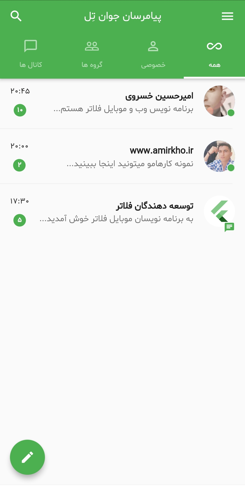
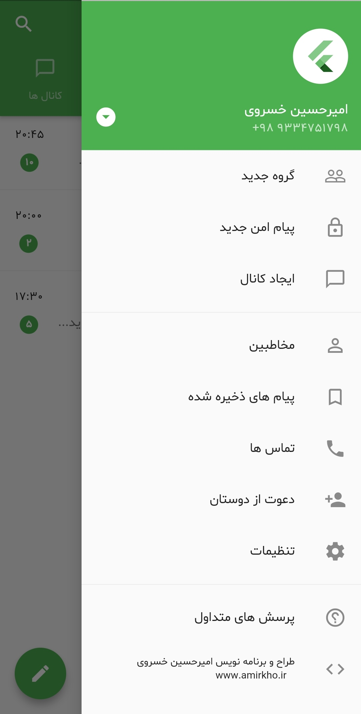
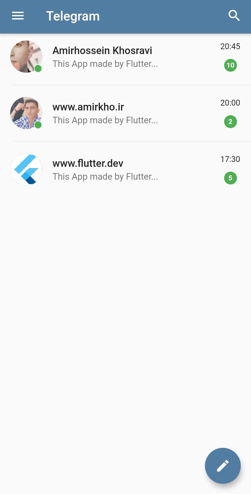

## RTL Flutter Chat UI

**Description:**

This Flutter app just uses pure Material() Components. Some of those Components(AppBar,ListView,ListTile,Stack...)

**Screenshots:**
###### Main page

###### Drawer Menu

###### Telegram 

